# Player-faction-customization

Player-faction-customization is a mod for [Starsector](https://fractalsoftworks.com/) that implements a streamlined system to customize your faction's ships and loadouts. It generates known blueprints based on existing ships, but with the sprites you define, creating a unique look for you faction's fleets. Also, when you configure variants and loadouts for your own fleet, these will get transfered and prioritized by your faction when generating fleets.

For more in-depth information on modding refer to the following resources:

- Intro to modding - https://starsector.fandom.com/wiki/Intro_to_Modding
- skin files - https://starsector.fandom.com/wiki/.skin_File_Overview
- mod tools - https://fractalsoftworks.com/forum/index.php?topic=12725.0
- full spriting tutorial - https://fractalsoftworks.com/forum/index.php?topic=11036.0
- GIMP Recolorize - https://www.youtube.com/watch?v=S3idTrbnggI

### Highlights
- Separate skins and category for your faction specific ships/skins
- Campaign Integration to not disrupt immersion
- Automatic generation of faction ship variants based on your own configured variants

## Caveat: Right now, variants in your faction fleet generation are updated at the beginning of the month or when you add a new variant in the refit screen. If you don't see them, try check/uncheck on priority ships to refresh.

## Step 1 - Create ships and sprites

Create your own ships based on existing skins and hulls, put them in the required locations.

Alternatively, you can use one of the provided packs (WIP). Copy the pack zip in the root mod folder (example: 
Starsector/mods/Player-Faction-Customization/) and extract. Follow the same structure for your creations.
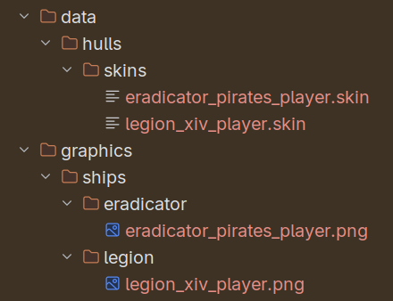

Take one of the existing sprites and recolorize (that's what I did)

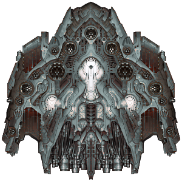

Create a skin file for the new ship based on an existing ship. Pay attention to the following lines:
- `"baseHullId":"legion",` - **The base hull for which you're creating the skin. Either keep the base hull id if you're copying a skin (like this example for the Legion (XIV)), or if you're creating a skin based on a base hull, make sure this id points to a .ship file (found in data/hulls/)**
- `"skinHullId":"legion_xiv_player",` - **The id of your new ship**
- `"hullName":"Legion (XIV-DAC)",` - **The display name of your new ship**
- `"descriptionId":"legion",`
- `"descriptionPrefix":"This ship a repaint of the Legion (XIV).",`  - **The description of your new ship**
- `"tags":["no_bp_drop","dep_legion_xiv"],`  - **MUST add these tags. no_bp_drop - prevents drops, dep_legion_xiv - sets legion_xiv as a dependency. Meaning your ship won't be generated until you learn the dependency's blueprint - in this case Legion (XIV)**
- `"tech":"player",` - **Manufacturer of the ship. This is the id of the player faction. MUST be like this**
- `"fleetPoints":30,`
- `"ordnancePoints":310,`
- `"baseValueMult":1.75,`
- `"spriteName":"graphics/ships/legion/legion_xiv_player.png",`  - **The new shiny sprite**

## Step 2 - Getting access to our ship in-game

The first thing you need to do is have a colony with either Heavy Industry or Orbital Works. Your engineers will get to work and repaint 
any existing designs you know that have a correspondent "player" manufactured ship.

The generation of the new ship design is made at the end of the month, during the Economy calculation. Remember, you need to have 
learned the blueprint.

Below we see the Legion (XIV-DAC) is already learned and we are expecting the Eradicator (DAC) to pop-up.

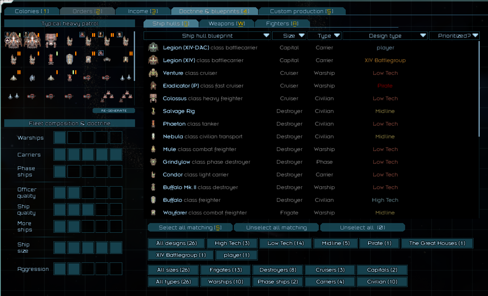

On the 1st of the new month, we get a notification telling us the ships that have been added for our faction.

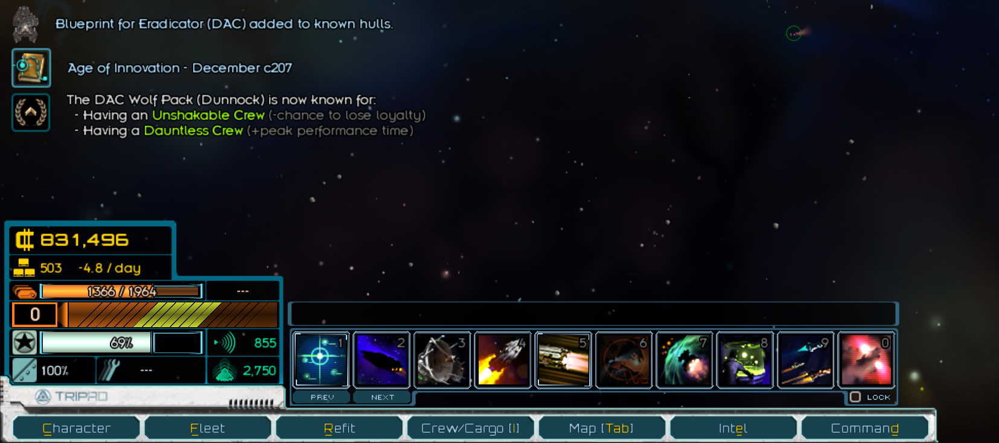

And we can see the new design in the doctrine screen. But still, our faction isn't making use of it. More on that in the next step.

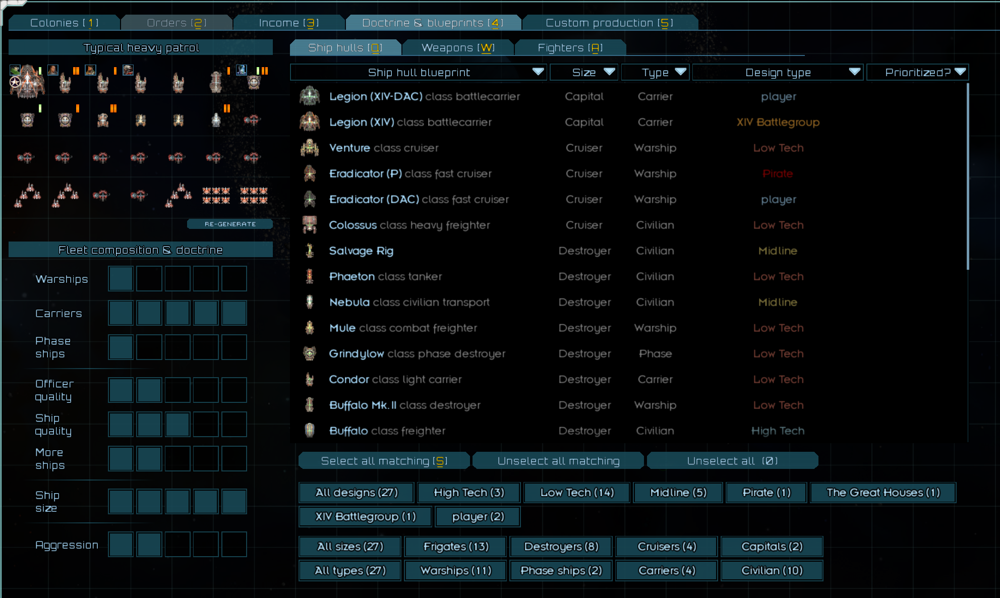

## Step 3 - Making faction fleets use the design

In order to make the design available to our faction's fleets, first we need to set the designs as priority. Don't forget to click Confirm

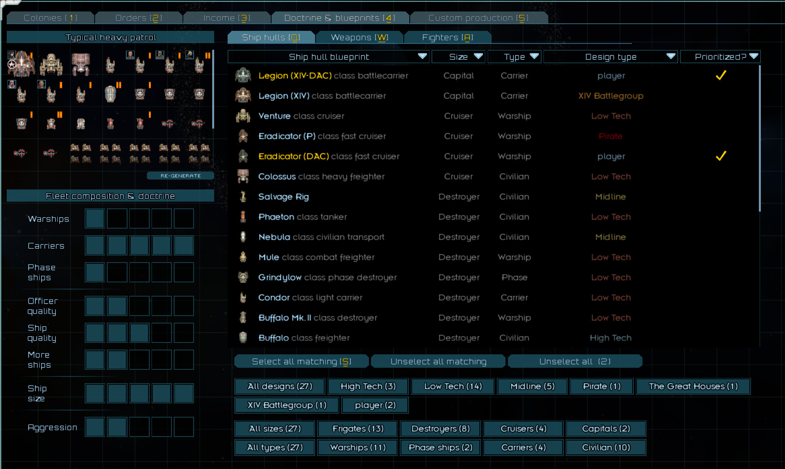

Then, we go to our fleet and build some variants.

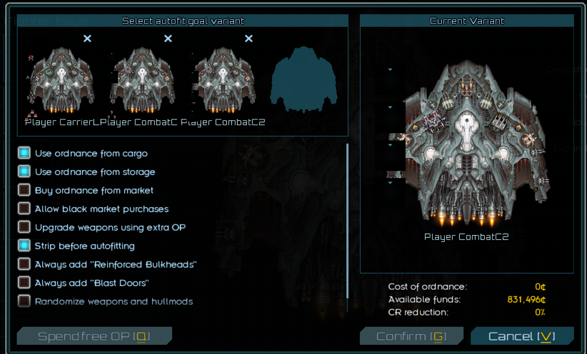

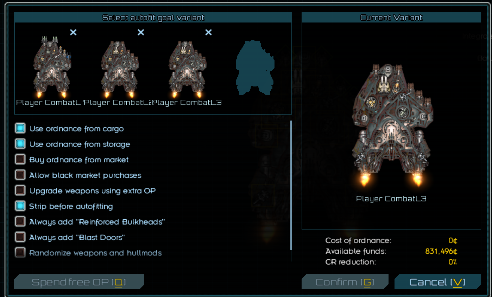

When you exit the refit screen and again, at the end of the month, together with the design generation, the variants that we configured 
will be distributed to combat roles and loaded up to our fleets. The variants that the player configures will take over the whole role and exclude any other variants 
configured elsewhere. For roles that cannot be found in player variants, it's business as always. For now, only combat roles are being 
taken into consideration.

Fleet Roles are currently defined as:

    //Carriers
    if ((variant.isCivilian() == false || variant.isCombat()) && variant.isCarrier()) {
        if (variant.getHullSize().equals(ShipAPI.HullSize.CAPITAL_SHIP) && variant.getFittedWings().size() >= 4)
    return EnumShipRoles.CARRIER_LARGE;
        if (variant.getHullSize().equals(ShipAPI.HullSize.CRUISER) && variant.getFittedWings().size() >= 3)
    return EnumShipRoles.CARRIER_MEDIUM;
        if (variant.getHullSize().equals(ShipAPI.HullSize.DESTROYER) && variant.getFittedWings().size() >= 2)
    return EnumShipRoles.CARRIER_SMALL;
    }
  
    //Phase
    if ((variant.isCivilian() == false || variant.isCombat()) && variant.getHullSpec().isPhase()) {
        if (variant.getHullSize().equals(ShipAPI.HullSize.CAPITAL_SHIP))
            return EnumShipRoles.PHASE_CAPITAL;
        if (variant.getHullSize().equals(ShipAPI.HullSize.CRUISER))
            return EnumShipRoles.PHASE_LARGE;
        if (variant.getHullSize().equals(ShipAPI.HullSize.DESTROYER))
            return EnumShipRoles.PHASE_MEDIUM;
        if (variant.getHullSize().equals(ShipAPI.HullSize.FRIGATE))
            return EnumShipRoles.PHASE_SMALL;
    }
  
    //Warships
    if ((variant.isCivilian() == false || variant.isCombat())) {
        if (variant.getHullSize().equals(ShipAPI.HullSize.CAPITAL_SHIP))
            return EnumShipRoles.COMBAT_CAPITAL;
        if (variant.getHullSize().equals(ShipAPI.HullSize.CRUISER))
            return EnumShipRoles.COMBAT_LARGE;
        if (variant.getHullSize().equals(ShipAPI.HullSize.DESTROYER))
            return EnumShipRoles.COMBAT_MEDIUM;
        if (variant.getHullSize().equals(ShipAPI.HullSize.FRIGATE))
            return EnumShipRoles.COMBAT_SMALL;
    }

Chance of a specific variant appearing in the fleet is distributed evenly between player configured variants of the same Role.

    Hull, Variant, Role, Chance (10 is 100%)
    Eradicator (DAC), Player CombatL2, combatLarge, 3.3333333
    Eradicator (DAC), Player CombatL1, combatLarge, 3.3333333
    Legion (XIV-DAC), Player CarrierL, carrierLarge, 10.0
    Eradicator (DAC), Player CombatL3, combatLarge, 3.3333333
    Legion (XIV-DAC), Player CombatC2, combatCapital, 5.0
    Legion (XIV-DAC), Player CombatC1, combatCapital, 5.0

And here are our variants present in the doctrine screen.

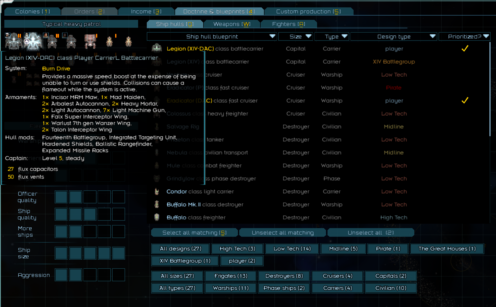

On the Campaign Map.

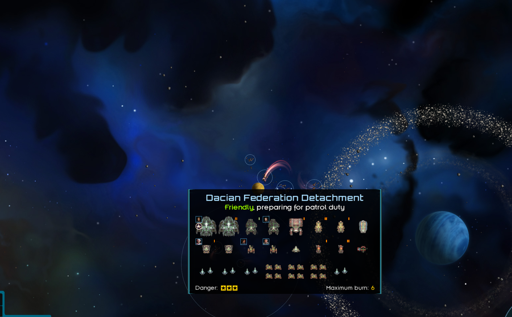

In interactions.

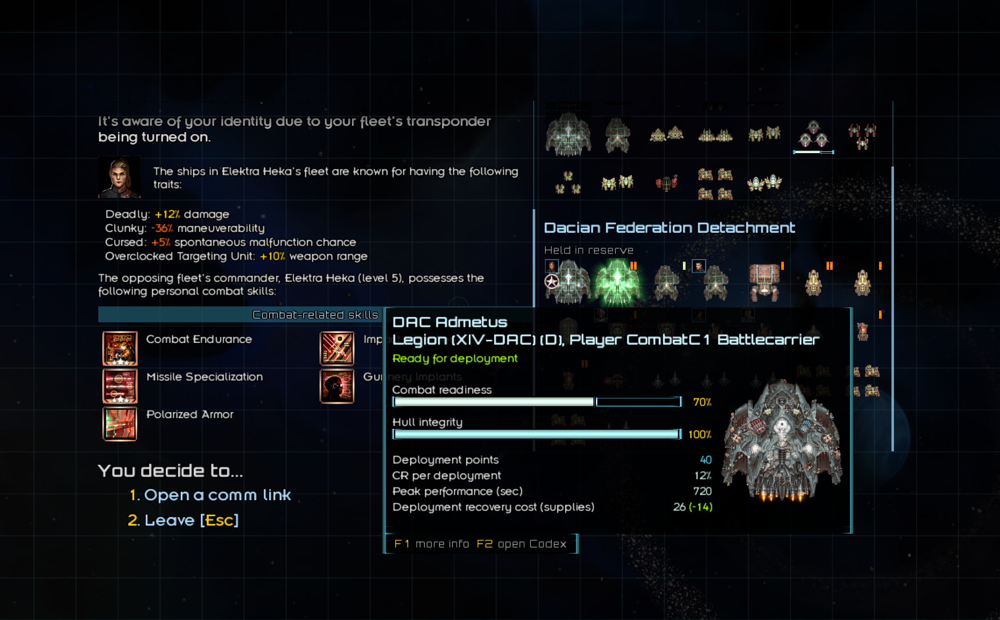

And in battle.

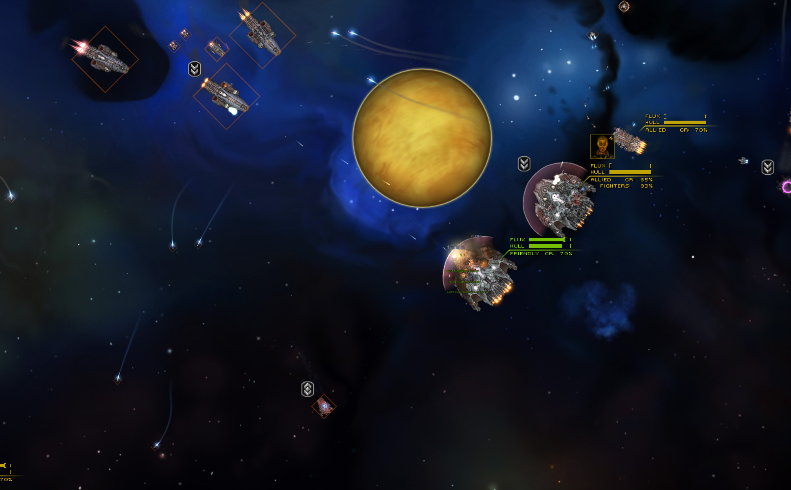
